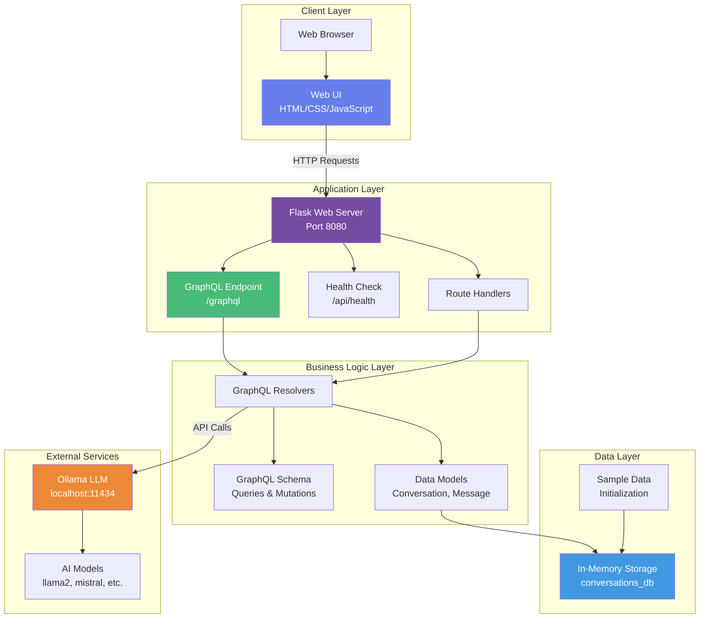
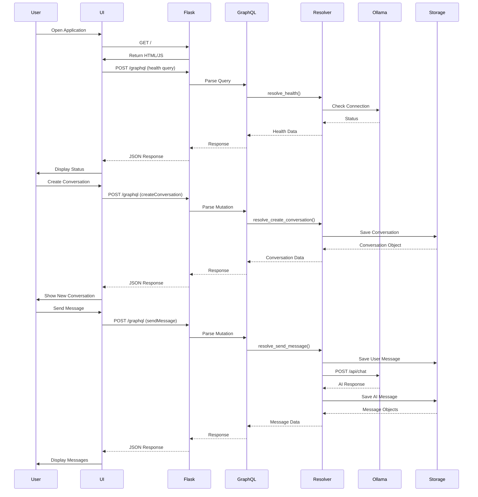
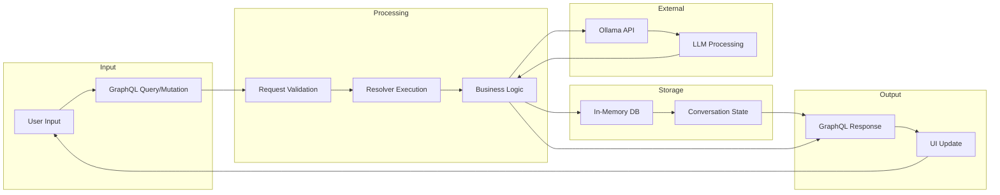
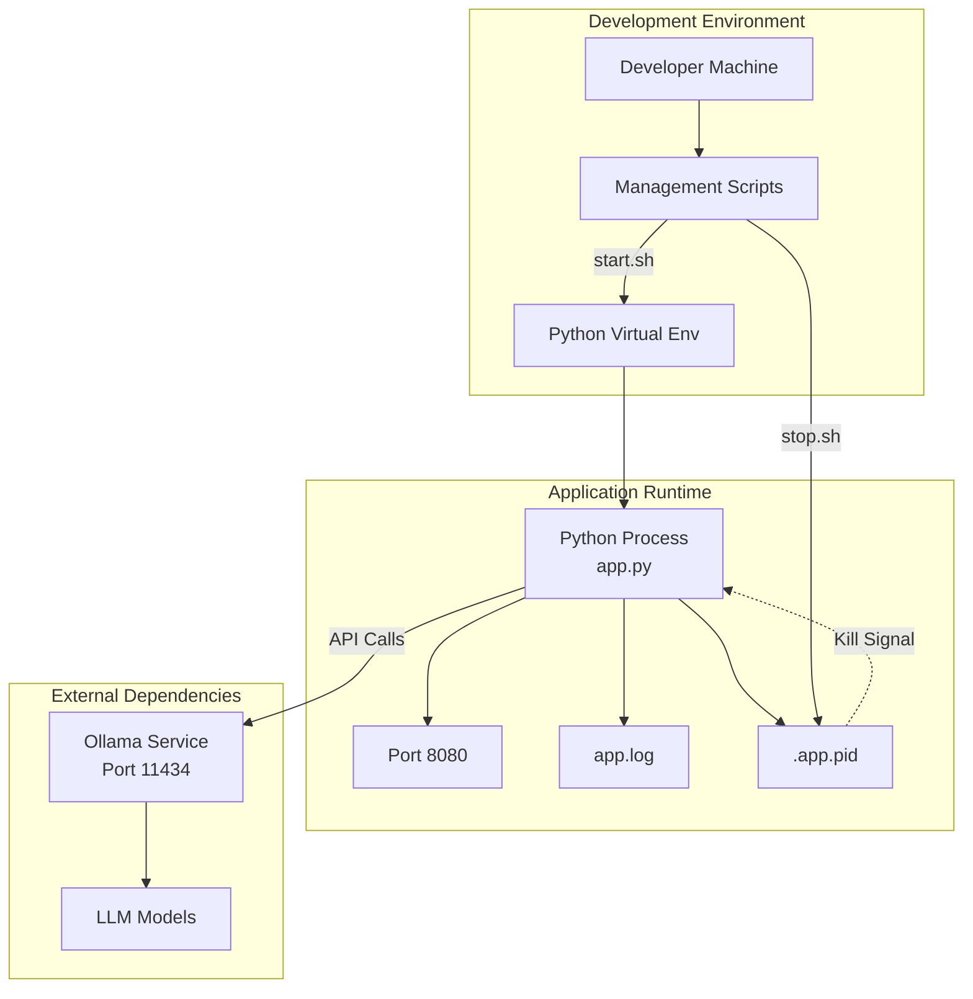
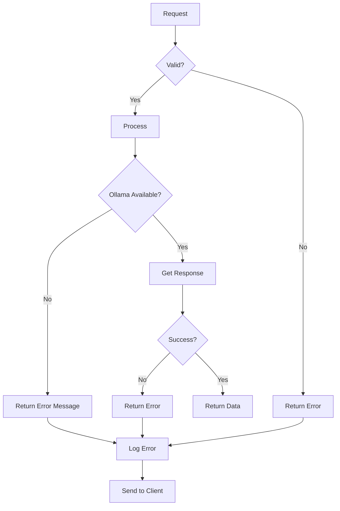

# GraphQLite + Ollama Application Architecture

## System Overview

This document describes the architecture of the GraphQLite + Ollama Chat Application, including component interactions, data flow, and system design.

## Architecture Diagram



## Component Flow Diagram



## Data Flow Architecture



## System Components

### 1. Web Server (Flask)

**Responsibilities:**
- HTTP request handling
- Route management
- CORS configuration
- Static file serving

**Key Features:**
- Runs on port 8080 (configurable)
- Supports GET and POST methods
- CORS enabled for cross-origin requests

### 2. GraphQL Layer

**Responsibilities:**
- Query parsing and validation
- Mutation execution
- Schema introspection
- Response formatting

**Endpoints:**
- `POST /graphql` - Execute queries/mutations
- `GET /graphql` - Schema introspection

### 3. Resolvers

**Query Resolvers:**
- `resolve_conversations()` - Get all conversations
- `resolve_conversation(id)` - Get specific conversation
- `resolve_available_models()` - List Ollama models
- `resolve_health()` - System health check

**Mutation Resolvers:**
- `resolve_create_conversation(title, model)` - Create new conversation
- `resolve_send_message(conversationId, content)` - Send message and get AI response
- `resolve_delete_conversation(id)` - Delete conversation

### 4. Data Models

**Conversation:**
```python
@dataclass
class Conversation:
    id: str
    title: str
    messages: List[Message]
    model: str
    created_at: str
```

**Message:**
```python
@dataclass
class Message:
    id: str
    role: str  # "user" or "assistant"
    content: str
    timestamp: str
```

### 5. Storage Layer

**Type:** In-Memory Dictionary
**Structure:**
```python
conversations_db = {
    "conv_1": Conversation(...),
    "conv_2": Conversation(...),
    ...
}
```

**Features:**
- Fast access
- No persistence (resets on restart)
- Pre-loaded with sample data
- Suitable for development/demo

### 6. Ollama Integration

**Connection:**
- Base URL: `http://localhost:11434`
- Endpoint: `/api/chat`
- Method: POST

**Request Format:**
```json
{
  "model": "llama2",
  "messages": [
    {"role": "user", "content": "Hello"}
  ],
  "stream": false
}
```

**Response Format:**
```json
{
  "message": {
    "role": "assistant",
    "content": "AI response here"
  }
}
```

### 7. Web UI

**Technology:** Vanilla JavaScript + HTML/CSS
**Features:**
- Responsive design
- Real-time updates
- Conversation management
- Message display
- Health status indicator

## Deployment Architecture



## Security Considerations

1. **CORS Configuration**
   - Enabled for development
   - Should be restricted in production

2. **Input Validation**
   - GraphQL schema validation
   - Type checking on all inputs

3. **Rate Limiting**
   - Not implemented (recommended for production)

4. **Authentication**
   - Not implemented (local development only)

5. **Data Persistence**
   - In-memory only (no sensitive data storage)

## Scalability Considerations

### Current Limitations:
- Single process (no load balancing)
- In-memory storage (no persistence)
- No caching layer
- Synchronous Ollama calls

### Future Improvements:
1. **Database Integration**
   - Add SQLite/PostgreSQL for persistence
   - Implement proper ORM (SQLAlchemy)

2. **Caching**
   - Redis for session management
   - Response caching for common queries

3. **Async Processing**
   - Async/await for Ollama calls
   - WebSocket support for streaming

4. **Load Balancing**
   - Multiple application instances
   - Nginx reverse proxy

## Performance Metrics

**Expected Response Times:**
- Health Check: < 100ms
- GraphQL Queries: < 200ms
- Message Send (with Ollama): 2-10s (depends on model)
- UI Load: < 500ms

**Resource Usage:**
- Memory: ~50-100MB (without models)
- CPU: Low (idle), High (during LLM inference)
- Network: Minimal (local only)

## Error Handling



## Monitoring and Logging

**Log Locations:**
- Application logs: `app.log`
- Process ID: `.app.pid`

**Health Checks:**
- Endpoint: `/api/health`
- Checks: Application status, Ollama connectivity

**Metrics Tracked:**
- Request count
- Response times
- Error rates
- Ollama connection status

## Technology Stack

| Layer | Technology | Version |
|-------|-----------|---------|
| Backend | Python | 3.8+ |
| Web Framework | Flask | 3.0.0 |
| GraphQL | graphqlite | 0.1.0 |
| LLM Runtime | Ollama | Latest |
| Frontend | Vanilla JS | ES6+ |
| Styling | CSS3 | - |

## Conclusion

This architecture provides a solid foundation for a GraphQL-based chat application with LLM integration. The modular design allows for easy extension and modification while maintaining simplicity for development and demonstration purposes.