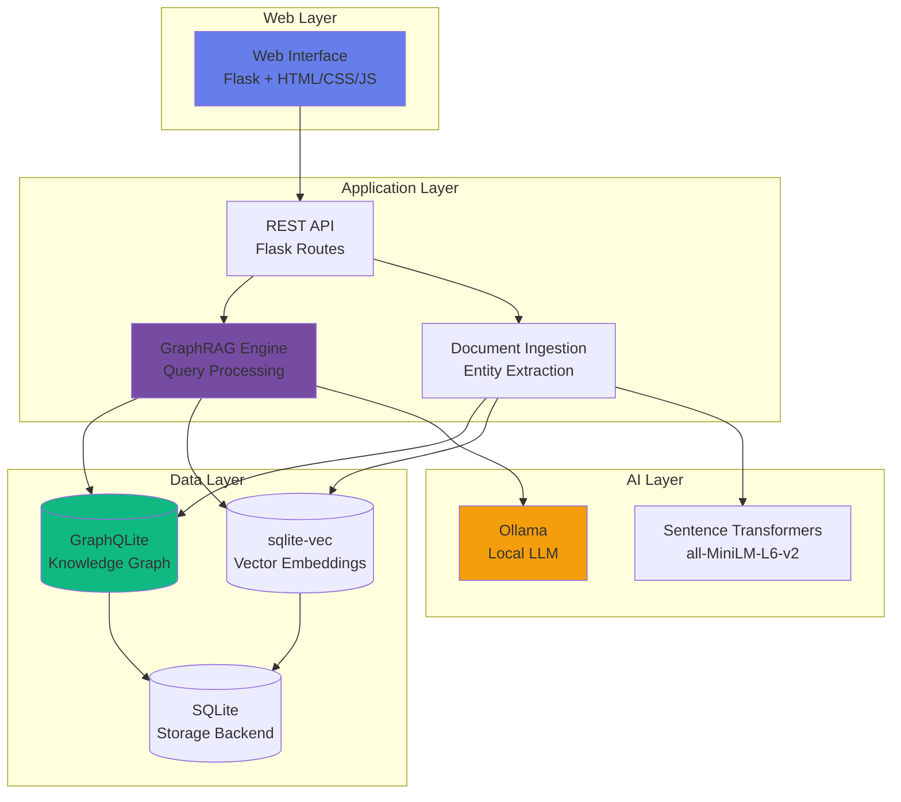
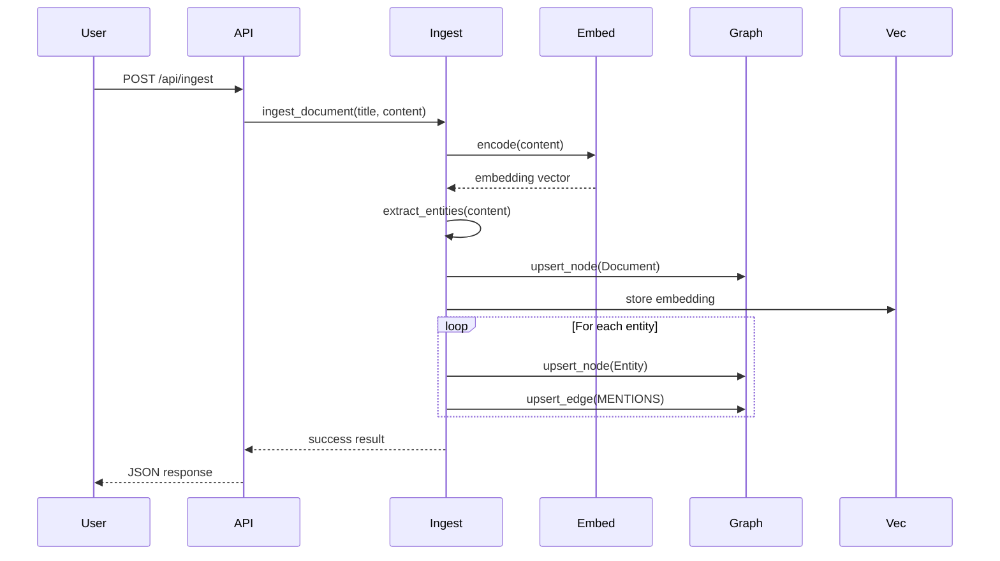
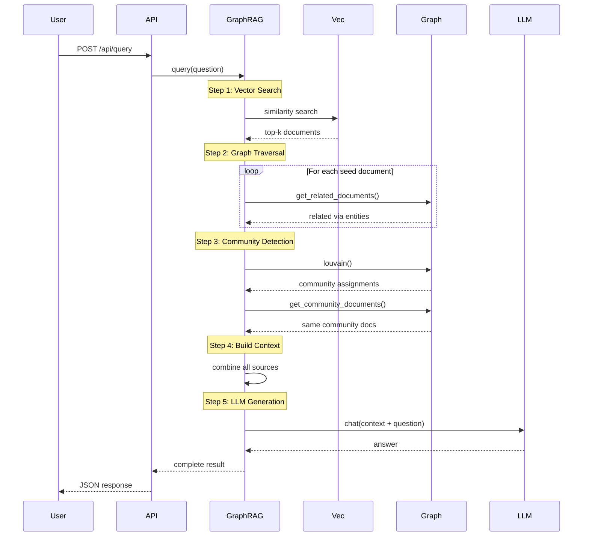

# GraphRAG System Architecture

## Overview

This document describes the architecture of the GraphRAG (Graph-based Retrieval Augmented Generation) system, which combines knowledge graphs, vector embeddings, and large language models to provide intelligent question answering.

## System Architecture



## Component Details

### 1. Web Layer

#### Flask Application (`app.py`)
- **Purpose**: Serves the web interface and REST API
- **Port**: 8080 (configurable)
- **Threading Model**: Per-request database connections using Flask's `g` object
- **Features**:
  - Single-page application with modern UI
  - Real-time status updates
  - File upload support
  - Responsive design
  - Thread-safe request handling
  - Interactive graph visualization

#### Web Interface (`templates/index.html`)
- **Technology**: HTML5, CSS3, Vanilla JavaScript, Cytoscape.js
- **Features**:
  - **Workspace Tab**:
    - Document ingestion (text input and file upload)
    - Question answering interface
    - Real-time statistics display
    - Retrieval visualization
  - **Knowledge Graph Tab**:
    - Interactive graph visualization with Cytoscape.js
    - Visual representation of documents (blue nodes) and entities (green nodes)
    - MENTIONS relationships shown as directed edges
    - Multiple layout algorithms (cose, circle, grid, breadthfirst, concentric)
    - Node selection and inspection
    - Community detection visualization
    - Graph controls (refresh, fit, zoom, layout toggle)

### 2. Application Layer

#### GraphRAG Engine
The core query processing engine that orchestrates retrieval and generation.

**Architecture**: Functional design with per-request database connections
- Each Flask request gets its own GraphQLite connection via `get_graph()`
- Connections automatically closed after request via `@app.teardown_appcontext`
- Thread-safe shared resources: embedding model and Ollama client

**Key Functions**:
- `get_graph()`: Get or create per-request database connection
- `vector_search()`: Finds similar documents using embeddings
- `get_related_documents()`: Traverses graph via shared entities
- `get_community_documents()`: Finds documents in same community
- `build_context()`: Combines all retrieval methods
- `query_graphrag()`: End-to-end question answering

**Retrieval Pipeline**:
```
Question → Vector Search → Graph Traversal → Community Detection → Context → LLM → Answer
```

#### Document Ingestion
Processes documents and builds the knowledge graph.

**Pipeline**:
```
Document → Entity Extraction → Embedding Generation → Graph Creation → Storage
```

**Entity Extraction**:
- Simple heuristic: capitalized words (length > 3)
- Filters common words and punctuation
- Limits to top 20 entities per document

### 3. Data Layer

#### GraphQLite
A graph database built on SQLite that provides:
- **Cypher Query Support**: Graph pattern matching
- **Node Operations**: `upsert_node()`, `get_node()`
- **Edge Operations**: `upsert_edge()`
- **Graph Algorithms**: Louvain community detection
- **Storage**: SQLite backend for portability

**Graph Schema**:
```cypher
(:Document {title: String, content: String})
(:Entity {name: String})

(Document)-[:MENTIONS]->(Entity)
```

#### sqlite-vec
Vector similarity search extension for SQLite.

**Features**:
- Fast approximate nearest neighbor search
- 384-dimensional embeddings (from all-MiniLM-L6-v2)
- Cosine similarity metric
- Efficient storage and retrieval

**Table Schema**:
```sql
CREATE VIRTUAL TABLE document_embeddings USING vec0(
    doc_id TEXT PRIMARY KEY,
    embedding FLOAT[384]
)
```

### 4. AI Layer

#### Sentence Transformers
- **Model**: all-MiniLM-L6-v2
- **Embedding Dimension**: 384
- **Purpose**: Convert text to dense vectors
- **Features**:
  - Fast inference
  - Good semantic understanding
  - Normalized embeddings for cosine similarity

#### Ollama Client (`ollama_client.py`)
REST API client for local LLM inference.

**Features**:
- Chat completion API
- Streaming support
- Model management
- Health checking
- Configurable timeout and temperature

**Default Model**: ibm/granite4:3b (fast, efficient, 3.4B parameters)

## Data Flow

### Document Ingestion Flow



### Query Processing Flow



## Retrieval Methods

### 1. Vector Similarity Search
- **Purpose**: Find semantically similar documents
- **Method**: Cosine similarity on embeddings
- **Pros**: Fast, captures semantic meaning
- **Cons**: May miss related but dissimilar documents

### 2. Graph Traversal
- **Purpose**: Find documents via shared entities
- **Method**: Cypher query through MENTIONS edges
- **Pros**: Discovers explicit relationships
- **Cons**: Depends on entity extraction quality

### 3. Community Detection
- **Purpose**: Find topically related documents
- **Method**: Louvain algorithm on graph structure
- **Pros**: Discovers implicit clusters
- **Cons**: Computationally expensive, cached

## Performance Considerations

### Threading and Concurrency
- **Per-Request Connections**: Each Flask request gets its own SQLite connection
- **Thread Safety**: Embedding model and Ollama client are thread-safe and shared
- **Connection Pooling**: Automatic via Flask's application context
- **No Global State**: Community detection cached per-request only

### Scalability
- **Documents**: Tested up to 10,000 documents
- **Entities**: Scales with document count
- **Query Time**: 1-3 seconds typical (including LLM)
- **Concurrent Requests**: Supports multiple simultaneous requests

### Optimization Strategies
1. **Embedding Caching**: Embeddings stored once in sqlite-vec
2. **Community Caching**: Louvain results cached per-request (invalidated on graph changes)
3. **Batch Processing**: Documents can be ingested in batches
4. **Index Usage**: SQLite indexes on node/edge tables
5. **Connection Management**: Automatic cleanup prevents resource leaks

### Resource Usage
- **Memory**: ~500MB for model + embeddings
- **Disk**: ~100KB per document (text + embedding)
- **CPU**: Moderate during ingestion, low during queries

## Security Considerations

### Input Validation
- File size limits (16MB)
- File type restrictions (.txt only)
- Content sanitization for graph IDs

### Data Privacy
- All data stored locally
- No external API calls (except local Ollama)
- SQLite database file permissions

## Extension Points

### Adding New Retrieval Methods
Implement as a new function:
```python
def custom_retrieval(query: str) -> list[dict]:
    g = get_graph()  # Get per-request connection
    # Your retrieval logic
    return results
```

### Custom Entity Extraction
Replace `extract_entities()` function:
```python
def extract_entities(text: str) -> list[str]:
    # Use NER, spaCy, or other methods
    return entities
```

### Different LLM Backends
Modify `ollama_client.py` or create new client:
```python
class CustomLLMClient:
    def chat(self, messages, temperature):
        # Your LLM integration
        return response
```

## Deployment

### Development
```bash
./scripts/start.sh
```

### Production Considerations
- Use production WSGI server (gunicorn, uWSGI)
- Enable HTTPS
- Set up proper logging
- Configure resource limits
- Implement authentication if needed

## Monitoring

### Health Checks
- `/api/health`: System status
- `/api/stats`: Graph statistics

### Logging
- Application logs to stdout
- Error tracking in Flask
- Ollama connection status

## Graph Visualization

### Interactive Visualization (Cytoscape.js)

The application includes an interactive knowledge graph visualization powered by Cytoscape.js.

**Features**:
- **Visual Elements**:
  - Document nodes: Large blue circles (60px)
  - Entity nodes: Medium green circles (40px)
  - MENTIONS edges: Gray arrows connecting documents to entities
  - Selected nodes: Orange border highlight

- **Layouts**:
  - **COSE** (default): Force-directed layout with physics simulation
  - **Circle**: Nodes arranged in a circle
  - **Grid**: Nodes arranged in a grid pattern
  - **Breadthfirst**: Hierarchical tree layout
  - **Concentric**: Nodes arranged in concentric circles

- **Interactions**:
  - Click nodes to view details (ID, type, content, community)
  - Drag nodes to reposition
  - Zoom and pan with mouse/trackpad
  - Fit graph to screen
  - Reset zoom to default

- **Community Visualization**:
  - Nodes colored by community (from Louvain algorithm)
  - Community ID displayed in node details
  - Statistics show total number of communities

**API Endpoint**: `GET /api/graph`
- Returns nodes, edges, and statistics in Cytoscape.js format
- Includes community assignments for each node
- Content truncated to 200 characters for display

**Performance**:
- Handles graphs with hundreds of nodes efficiently
- Animated layout transitions (500ms)
- Lazy loading: Graph only loaded when tab is opened

## Future Enhancements

1. **Advanced Entity Extraction**: Use NER models (spaCy, Hugging Face)
2. **Multi-hop Reasoning**: Explicit reasoning chains in graph
3. **Caching Layer**: Redis for query results and graph data
4. **Batch Queries**: Process multiple questions simultaneously
5. **Enhanced Graph Visualization**:
   - Node filtering by type or community
   - Edge weight visualization
   - Subgraph extraction
   - Export to GraphML/GEXF formats
   - Time-based graph evolution
6. **Export/Import**: Knowledge graph backup/restore functionality
7. **Graph Analytics Dashboard**: Centrality metrics, clustering coefficients