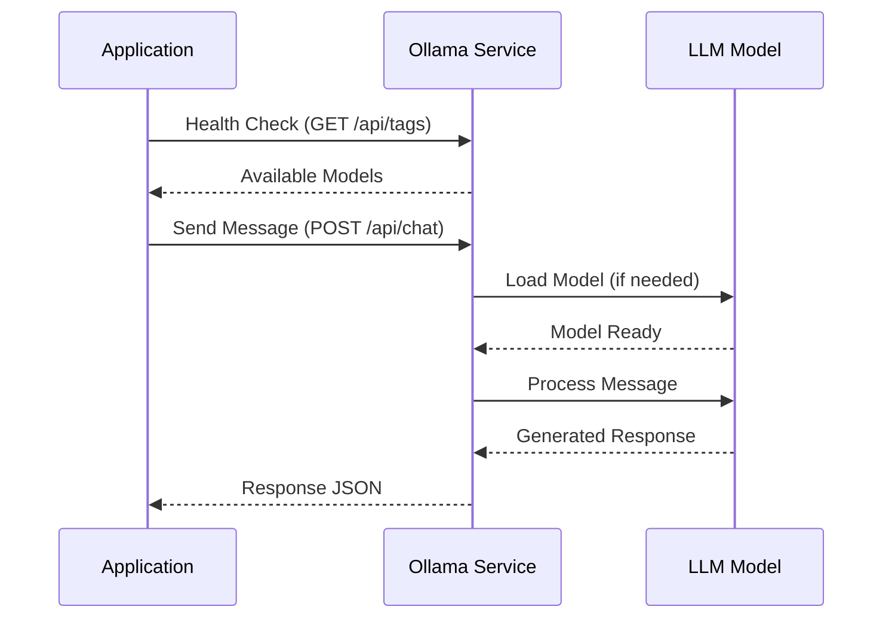

# Ollama Integration Guide

Complete guide for integrating and working with Ollama in the GraphQLite Chat Application.

## Table of Contents

1. [What is Ollama?](#what-is-ollama)
2. [Installation](#installation)
3. [Configuration](#configuration)
4. [Available Models](#available-models)
5. [Integration Details](#integration-details)
6. [API Communication](#api-communication)
7. [Troubleshooting](#troubleshooting)
8. [Advanced Usage](#advanced-usage)

---

## What is Ollama?

Ollama is a lightweight, extensible framework for running large language models (LLMs) locally on your machine. It provides:

- **Local Execution**: Run AI models without cloud dependencies
- **Privacy**: Your data stays on your machine
- **Speed**: No network latency for API calls
- **Cost**: Free to use, no API fees
- **Flexibility**: Multiple models available

### Key Features

- Easy model management
- REST API for integration
- Support for various LLM models
- Efficient resource usage
- Cross-platform support (macOS, Linux, Windows)

---

## Installation

### macOS

```bash
# Download and install from website
# Visit: https://ollama.ai/download

# Or use Homebrew
brew install ollama
```

### Linux

```bash
curl -fsSL https://ollama.ai/install.sh | sh
```

### Windows

Download the installer from [ollama.ai/download](https://ollama.ai/download)

### Verify Installation

```bash
ollama --version
```

---

## Configuration

### Starting Ollama

```bash
# Start Ollama service
ollama serve
```

The service will start on `http://localhost:11434` by default.

### Pulling Models

Before using a model, you need to pull it:

```bash
# Pull Llama 2 (7B parameters)
ollama pull llama2

# Pull Mistral (7B parameters)
ollama pull mistral

# Pull Code Llama (7B parameters)
ollama pull codellama

# Pull other models
ollama pull neural-chat
ollama pull orca-mini
```

### Listing Installed Models

```bash
ollama list
```

Output example:
```
NAME              ID              SIZE      MODIFIED
llama2:latest     78e26419b446    3.8 GB    2 hours ago
mistral:latest    61e88e884507    4.1 GB    1 day ago
codellama:latest  8fdf8f752f6e    3.8 GB    3 days ago
```

### Removing Models

```bash
ollama rm llama2
```

---

## Available Models

### Recommended Models

| Model | Size | Best For | Speed | Quality |
|-------|------|----------|-------|---------|
| **Llama 2** | 3.8GB | General conversation | Medium | High |
| **Mistral** | 4.1GB | Fast responses | Fast | High |
| **Code Llama** | 3.8GB | Programming tasks | Medium | High |
| **Neural Chat** | 4.1GB | Conversational AI | Medium | High |
| **Orca Mini** | 1.9GB | Quick tasks | Very Fast | Medium |

### Model Variants

Most models come in different sizes:

```bash
# 7B parameters (default)
ollama pull llama2

# 13B parameters (better quality, slower)
ollama pull llama2:13b

# 70B parameters (best quality, requires more resources)
ollama pull llama2:70b
```

### Choosing a Model

**For General Use:**
- Start with `llama2` - good balance of speed and quality

**For Programming:**
- Use `codellama` - specialized for code generation and explanation

**For Speed:**
- Use `mistral` or `orca-mini` - faster responses

**For Quality:**
- Use larger variants (13b, 70b) if you have the resources

---

## Integration Details

### How the Application Connects to Ollama

The application communicates with Ollama through its REST API:

```python
# Configuration
OLLAMA_BASE_URL = 'http://localhost:11434'

# Health check
response = requests.get(f"{OLLAMA_BASE_URL}/api/tags")

# Send message
response = requests.post(
    f"{OLLAMA_BASE_URL}/api/chat",
    json={
        "model": "llama2",
        "messages": [
            {"role": "user", "content": "Hello"}
        ],
        "stream": False
    }
)
```

### Connection Flow



### Context Management

The application maintains conversation context by sending the last 5 messages:

```python
# Build context from conversation history
messages = []
for msg in conversation.messages[-5:]:  # Last 5 messages
    messages.append({
        "role": msg.role,
        "content": msg.content
    })

# Add new user message
messages.append({
    "role": "user",
    "content": new_message
})
```

This allows the AI to:
- Remember previous messages
- Maintain conversation flow
- Provide contextual responses

---

## API Communication

### Ollama API Endpoints

#### 1. List Models

```bash
GET http://localhost:11434/api/tags
```

Response:
```json
{
  "models": [
    {
      "name": "llama2:latest",
      "modified_at": "2024-03-26T10:00:00Z",
      "size": 3826793677
    }
  ]
}
```

#### 2. Generate Chat Response

```bash
POST http://localhost:11434/api/chat
```

Request:
```json
{
  "model": "llama2",
  "messages": [
    {
      "role": "user",
      "content": "What is GraphQL?"
    }
  ],
  "stream": false
}
```

Response:
```json
{
  "model": "llama2",
  "created_at": "2024-03-26T10:00:00Z",
  "message": {
    "role": "assistant",
    "content": "GraphQL is a query language for APIs..."
  },
  "done": true
}
```

#### 3. Generate Completion (Alternative)

```bash
POST http://localhost:11434/api/generate
```

Request:
```json
{
  "model": "llama2",
  "prompt": "What is GraphQL?",
  "stream": false
}
```

### Streaming Responses

For real-time streaming (not currently implemented):

```python
response = requests.post(
    f"{OLLAMA_BASE_URL}/api/chat",
    json={
        "model": "llama2",
        "messages": messages,
        "stream": True  # Enable streaming
    },
    stream=True
)

for line in response.iter_lines():
    if line:
        data = json.loads(line)
        print(data['message']['content'], end='', flush=True)
```

---

## Troubleshooting

### Ollama Not Starting

**Problem**: `ollama serve` fails to start

**Solutions**:

1. **Check if already running**
   ```bash
   ps aux | grep ollama
   ```

2. **Check port availability**
   ```bash
   lsof -i :11434
   ```

3. **View logs**
   ```bash
   # macOS
   tail -f ~/Library/Logs/Ollama/server.log
   
   # Linux
   journalctl -u ollama -f
   ```

4. **Restart service**
   ```bash
   # Kill existing process
   pkill ollama
   
   # Start again
   ollama serve
   ```

### Model Not Found

**Problem**: "model not found" error

**Solutions**:

1. **List installed models**
   ```bash
   ollama list
   ```

2. **Pull the model**
   ```bash
   ollama pull llama2
   ```

3. **Verify model name**
   - Use exact name from `ollama list`
   - Include tag if needed (e.g., `llama2:13b`)

### Slow Responses

**Problem**: AI takes too long to respond

**Causes & Solutions**:

1. **First Request After Start**
   - Model needs to load into memory
   - Subsequent requests will be faster
   - Solution: Wait for first request to complete

2. **Large Model**
   - 13B and 70B models are slower
   - Solution: Use 7B models for faster responses

3. **Insufficient Resources**
   - Check RAM usage
   - Solution: Close other applications or use smaller model

4. **CPU vs GPU**
   - CPU inference is slower
   - Solution: Use GPU if available (NVIDIA/AMD)

### Connection Refused

**Problem**: Application can't connect to Ollama

**Solutions**:

1. **Verify Ollama is running**
   ```bash
   curl http://localhost:11434/api/tags
   ```

2. **Check firewall**
   - Ensure port 11434 is not blocked

3. **Check Ollama URL**
   - Default: `http://localhost:11434`
   - Verify in application configuration

4. **Restart both services**
   ```bash
   # Stop application
   ./scripts/stop.sh
   
   # Restart Ollama
   pkill ollama
   ollama serve
   
   # Start application
   ./scripts/start.sh
   ```

### Out of Memory

**Problem**: System runs out of memory

**Solutions**:

1. **Use smaller model**
   ```bash
   ollama pull orca-mini  # Only 1.9GB
   ```

2. **Close other applications**

3. **Increase swap space** (Linux)
   ```bash
   sudo fallocate -l 8G /swapfile
   sudo chmod 600 /swapfile
   sudo mkswap /swapfile
   sudo swapon /swapfile
   ```

4. **Check system requirements**
   - Minimum: 8GB RAM
   - Recommended: 16GB+ RAM

---

## Advanced Usage

### Custom Ollama URL

If Ollama is running on a different machine or port:

```bash
# Set environment variable
export OLLAMA_URL=http://192.168.1.100:11434

# Start application
./scripts/start.sh
```

### Model Parameters

Customize model behavior (requires code modification):

```python
response = requests.post(
    f"{OLLAMA_BASE_URL}/api/chat",
    json={
        "model": "llama2",
        "messages": messages,
        "stream": False,
        "options": {
            "temperature": 0.7,      # Creativity (0-1)
            "top_p": 0.9,           # Nucleus sampling
            "top_k": 40,            # Top-k sampling
            "num_predict": 512,     # Max tokens
            "stop": ["\n\n"]        # Stop sequences
        }
    }
)
```

### Using Custom Models

1. **Create a Modelfile**
   ```bash
   # Create Modelfile
   cat > Modelfile << EOF
   FROM llama2
   PARAMETER temperature 0.8
   PARAMETER top_p 0.9
   SYSTEM You are a helpful coding assistant.
   EOF
   ```

2. **Create the model**
   ```bash
   ollama create my-custom-model -f Modelfile
   ```

3. **Use in application**
   - Select "my-custom-model" from the model dropdown

### Performance Optimization

1. **Keep Ollama Running**
   - Don't stop/start frequently
   - Models stay loaded in memory

2. **Use Appropriate Model Size**
   - 7B for most tasks
   - 13B for better quality
   - 70B only if needed and resources allow

3. **Limit Context Length**
   - Current: Last 5 messages
   - Adjust based on needs

4. **Enable GPU Acceleration**
   - Ollama automatically uses GPU if available
   - Verify: Check GPU usage during inference

### Monitoring Ollama

```bash
# Check running processes
ps aux | grep ollama

# Monitor resource usage
top -p $(pgrep ollama)

# View API logs
tail -f ~/Library/Logs/Ollama/server.log
```

---

## Best Practices

1. **Start Ollama First**
   - Always start Ollama before the application
   - Verify it's running before sending requests

2. **Choose Models Wisely**
   - Match model to task
   - Consider resource constraints

3. **Handle Errors Gracefully**
   - Check connection before requests
   - Provide fallback responses

4. **Monitor Resources**
   - Watch RAM usage
   - Monitor response times

5. **Keep Models Updated**
   ```bash
   ollama pull llama2  # Updates to latest version
   ```

---

## Resources

- **Ollama Website**: https://ollama.ai/
- **Ollama GitHub**: https://github.com/ollama/ollama
- **Model Library**: https://ollama.ai/library
- **Documentation**: https://github.com/ollama/ollama/tree/main/docs

---

## Summary

Ollama provides a powerful, local AI solution that integrates seamlessly with the GraphQLite Chat Application. By following this guide, you can:

- Install and configure Ollama
- Choose appropriate models
- Troubleshoot common issues
- Optimize performance
- Extend functionality

For application-specific integration details, see the [Architecture Documentation](architecture.md).